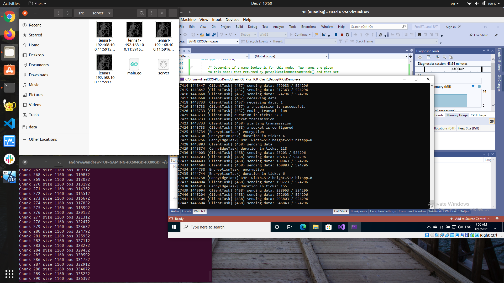

(Capstone: Autonomous Runway Detection for IoT)[https://www.coursera.org/learn/autonomous-runway-detection/]

## tcp_client: TCP server and client are written in Go

### tcp_server: main.c, rsa.c and canny.c at FreeRTOS-Plus/Demo/FreeRTOS_Plus_TCP_Client/

#### canny.c is provided by the course authors (Canny edge detector)[https://en.wikipedia.org/wiki/Canny_edge_detector]
  
#### rsa.c is my implementation (RSA algorithm)[https://simple.wikipedia.org/wiki/RSA_algorithm]
  
#### main.c include three tasks and two queues for communication between tasks: canny edge detection, RSA encryption and a TCP client

